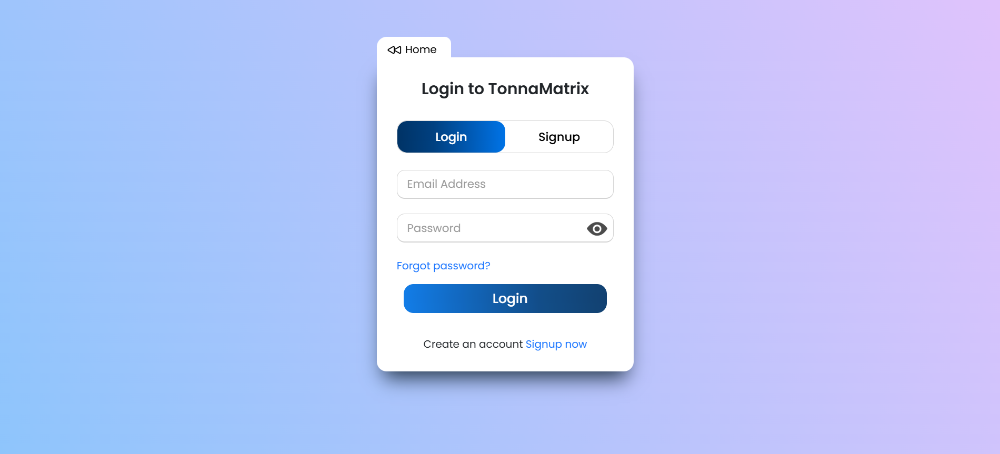
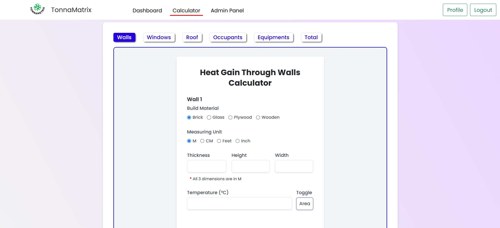

#### Project Preview





#### Setup the Project
`Requirements:`<br>
- `8 GB RAM`<br>
- `Code Editor` [VSCode](https://code.visualstudio.com/download)<br>
- `Git CLI` [Download](https://git-scm.com/downloads)<br>
- `python 3.11 or above` [Download](https://www.python.org/downloads/release/python-3110/)<br>
- `Web Browser Chrome`<br>

##### Update the file name of `.env.example` to `.env` and update the `EMAIL_HOST_USER` & `EMAIL_HOST_PASSWORD`:
- Obtain Your App Password from here : [Visit](https://myaccount.google.com/apppasswords)
- * You can skip the email setting by keeping it as default

##### Create Virtual Environment for the Project
```
python -m venv env
```

##### Activate Virtual Enviroment & Prepare Database
```
.\env\Scripts\activate
pip install -r requirements.txt
python manage.py makemigrations
python manage.py migrate
python manage.py createroles
```

###### Database setup is done now Create Admin User
```
python manage.py createsuperuser
```

###### InCase if you are getting error in above command so run the following Command in Powershell ISE
```
Set-ExecutionPolicy RemoteSigned -Scope CurrentUser
```
- Choose `Yes to All`
- And run the envionment activation commands

##### Run the Project
```
python manage.py runserver
```


###### Run Project with new Terminal
```
.\env\Scripts\activate
python manage.py runserver
```